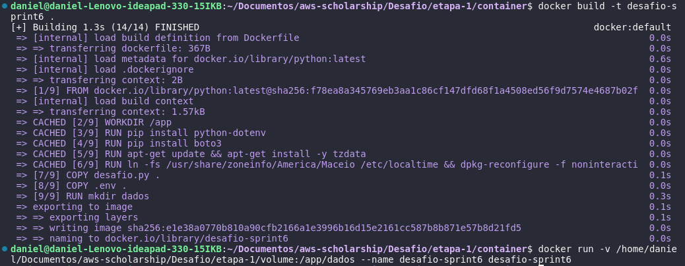
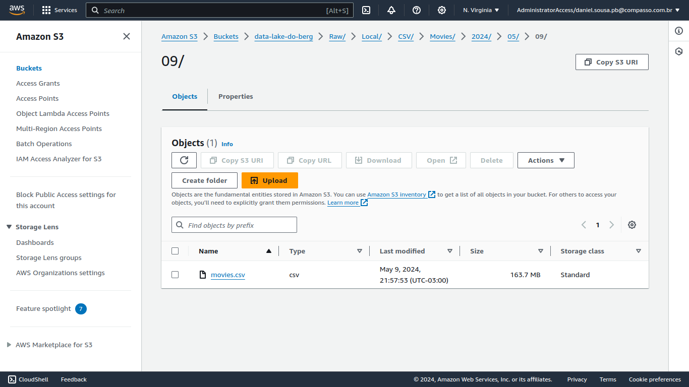
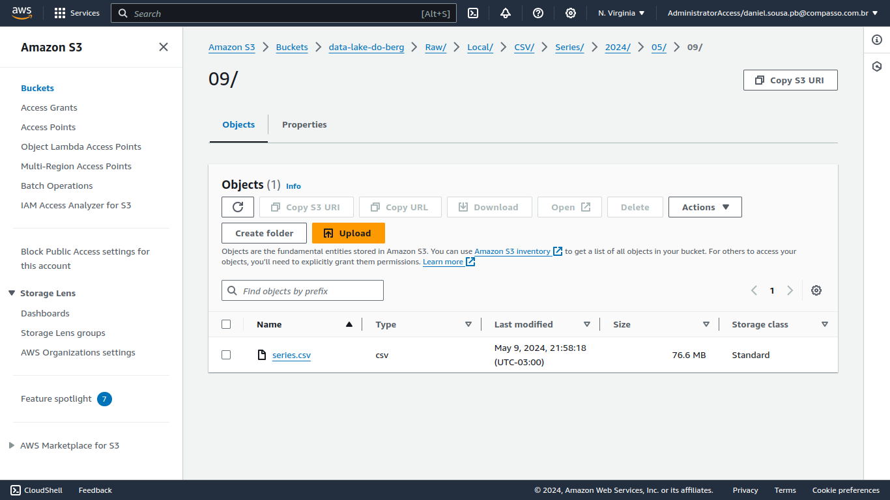

# Etapa I

Nesta etapa do desafio foi criado um bucket para armazenar dois arquivos csv: movies.csv e series.csv. Por enquanto não foi feita nenhuma tratativa sobre os dados.

## Desenvolvimento

* **Criação do código python**

[Código python](container/desafio.py)

Inicialmente foi criado um cliente para o serviço `s3` utilizando a função `client` do boto3. As variáveis de autenticação passadas para função foram obtidas a partir da leitura de um arquivo `.env`. Caso ocorresse algum erro de autenticação seria gerada uma exceção.

Após o cliente ter sido definido foi criado um bucket com a função do boto3 `create_bucket`, que recebia o nome do bucket como parâmetro.

Para subir os arquivos csv a implementação das funções foram iguais, utilizamos as funções `now` e `strftime` do pacote datetime para pegar a data atual e utilizar na criação do caminho relativo utilizado na estruturação de pastas do bucket. Por fim, com a função `open` do python foi feita a leitura do arquivo, o qual foi passado para a função `put_object` do boto3 em conjunto nome do bucket e o caminho onde o objeto seria armazenado.


* **Criação do Dockerfile**

[Dockerfile](container/Dockerfile)

1. Definido a utilização  do python.

2. Criação do diretório de trabalho.

3. Instalação dos módulos a serem utilizados no código.

4. Configuração do fuso horário para a data dentro do container.

5. Cópia dos arquivos .env e desafio.py para dentro do diretório de trabalho.

6. Criação de um diretório dados para ser utilizado como volume.

7. Definição do comando `python desafio.py` para ser executado na criação do container.

* **Criação da imagem e do container**

A imagem foi criada a partir do comando:

```shell
 docker build -t desafio-sprint6 .
```

Na criação do container foi linkado um diretório do host a um diretório do container para servir como volume:

```shell
docker run -v /home/daniel/Documentos/aws-scholarship/Desafio/etapa-1/volume:/app/dados --name desafio-sprint6 desafio-sprint6
```

Imagem da criação



* **Arquivos .CSV dentro do bucket**

movies.csv



series.csv

