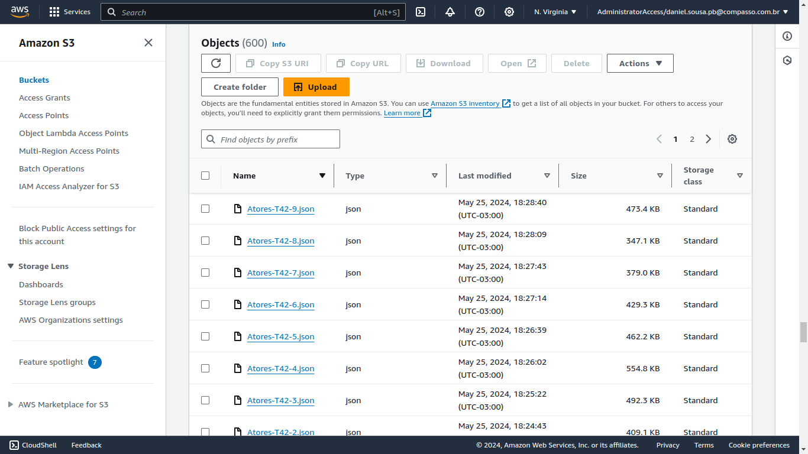

# Desafio 

## Objetivo:

Nesta etapa do desafio foram obtidos dados da API do TMDB e feita a ingestão dos mesmos em um bucket s3 a partir da execução de uma função lambda.

## Processo de desenvolvimento:

### Criação do código python

[Código python](desafio.py)

Inicialmente foi elaborado o código python para captura dos dados e ingestão dos mesmos no bucket s3, além da escolha de rotas para obtenção dos dados. As rotas escolhidas foram a captura de um filme por seu id do imdb, da qual era obtido od id do filme no TMDB e utilizado em uma rota de captura de créditos de um filme, assim os dados armazenados foram informaçoes sobre atores que participaram em um filme.

No fluxo de desenvolvimento do código foram elaboradas funções com as ações a serem realizadas no código. A primeira função `lambda_handler` dava início ao código, criando um DataFrame pandas com o ID's e gêneros dos filmes, sob a condição de que estes pertencessem aos gêneros de drama e romance, sendo também feita a remoção de linhas duplicatas. Em seguida era chamada a função `executarThreads` que recebia o conteúdo do DataFrame por parâmetro.

Na etapa de teste do código foi verificado que o tempo de execução das rotas e finalização do script superava o tempo definido pelo laboratório lambda que era de 15 minutos. Com isso em mente foi criada a função `executarThreads`, a qual recebia o DataFrame pandas criado anteriormente e criava um array com 60 arrays contendo os ID's de filmes e com tamanhos aproximadamente iguais. Em seguida foram criadas 60 threads dinamicamente para execução concorrente do código, as quais chamavam a função `buscarAtores`.

A função `buscarAtores` recebia o nome da thread que chamou sua execução e um array do conjunto de arrays formados pelos ID's de filmes, de modo que criava um loop de iteração pelo array fazendo a chamada da função `retornarAtores`, a qual recebia o ID de um filme e retornava os atores daquele filme, a cada 100 execuções da função `retornarAtores` a função `gravarAtores` era chamada para salvar os dados de 100 json's como um arquivo no bucket s3 da aws.

O processamento da função `retornarAtores` era feito através da execução de uma rota de captura de um filme por seu ID, utilizando se do ID recebido por parâmetro na função, seguida da captura do ID que o filme possuía no TMDB de dentro do Json retornado, com o qual era executado uma segunda rota de captura de créditos dos filme, nos quais estava o elenco do filme. Assim era retornado o json contendo os créditos.

Para encerrar o fluxo de tarefas era chamada a função `gravarAtores`, a qual recebia trecho do nome do arquivo para diferenciação dos nomes no bucket, além de um json contendo 100 outros json's. Assim era criado um novo arquivo dentro do  bucket por meio da chamada da função `put_object` do boto3.

### Criação da layer

Para execução do código python dentro de ambiente lambda foi necessário a configuração de uma layer personalizada, porém pude reutilizar a layer criada para o laboratório lambda anterior, que tinha informações quanto a versão do python utilizada, ambiente linux e biblioteca pandas, apenas precisei adicionar as bibliotecas numpy e requests para que o ambiente pudesse ser executado.

### Criação da política de acesso ao serviço S3

Para acessar o bucket s3 através da função lambda foi necessário criar uma política no IAM com permissões de acesso ao s3, para isso foi utilizado o código:

```python
{
    "Version": "2012-10-17",
    "Statement": [
        {
            "Effect": "Allow",
            "Action": [
                "s3:ListBucket"
            ],
            "Resource": [
                "arn:aws:s3:::data-lake-do-berg"
            ]
        },
        {
            "Effect": "Allow",
            "Action": [
                "s3:GetObject",
                "s3:PutObject",
                "s3:DeleteObject"
            ],
            "Resource": [
                "arn:aws:s3:::data-lake-do-berg/*"
            ]
        }
    ]
}
```

### Conclusão

Dessa forma foi criada uma pasta contendo 600 arquivos json no bucket que representa o DataLake do projeto.

- Arquivos JSON dentro do bucket:



