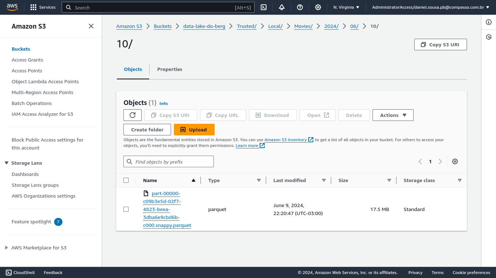
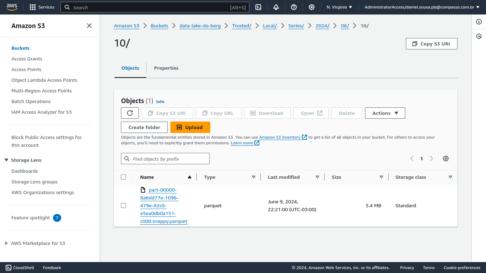
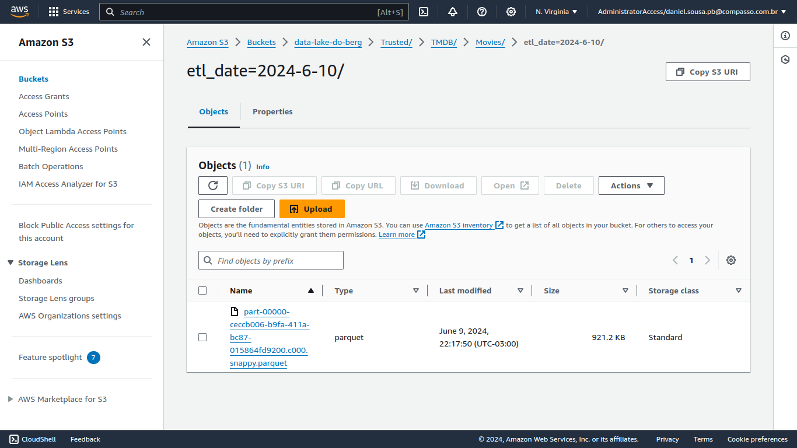

# Desafio 

## Objetivo:

Nessa sprint foi feita a limpeza dos dados oriundos dos arquivos CSV e da API do TMDB. O processamento desses dados foi realizado com a ferramenta spark no ambiente AWS glue.

## O que foi feito nos CSV:

* [Código do job do glue para limpeza dos csv.](job-csv.py)

O processo de limpeza dos arquivos dos csv conscentrou-se em duas principais etapas: seleção dos dados que seriam utilizados e limpeza das colunas. Os dados que serão trabalhados no CSV serão apenas os de Drama/Romance, logo não fazia sentido levar todos os filmes e séries para frente. O próximo passo foi remover o valor \N de campos vazios, substibuindo-o por 0 ou um espaço vazio a depender de para qual tipo seria convertida a coluna, sendo adotados os tipos string, integer e double para conversão das colunas. Por fim, foi feita a remoção de possíveis linhas duplicadas e com a função `coalesce()` foi especificado que os dados de filme e série teriam para cada um único parquet.

* Parquet de Movies:

* Parquet de Series:

## O que foi feito nos JSON:

* [Código do job do glue para limpeza dos JSON.](job-json.py)

Para limpeza dos arquivos json foi feita a seleção de colunas que seriam úteis ao data lake, pois a consulta a API traz muitos dados com fins extremamente especícificos. Em seguida foi feita a conversão das colunas para os tipos adequados ao parquet, não sendo necessário fazer a substituição de valores, uma vez que os dados da API tem tipos próprios e quando vazios adiquirem valor null ou 0. A coluna coluna tratada foi `origin_country`, a qual tinha como valor uma lista de strings, sendo transformada em uma string a partir da concatenação de valores. Foi feito também a espeficição de que deveria existir um arquivo único, através da função `coalesce()`, porém como foi feito o particionamento do dataFrame por meio da data do ETL, isso abre margem para arquivos separados em pastas diferentes a depender da variação da data do ETL.

* Parquet de Movies:

