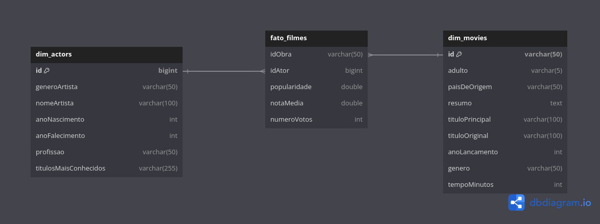

# Melhorias

## Alterações:

Nesta etapa do desafio foi necessário refazer a modelagem, pois a tabela fato foi criada de forma errada, de modo que apenas estava servindo como uma ligação entre as demais tabelas. Portanto, as melhorias feitas consistiram em remover tabelas que não seriam usadas na análise da sprint 10 e ajustar a tabela fato.

Como resultado a modelagem dimensional passou a ter 3 tabelas: a fato_filmes, a dim_movies e a dim_actors e o modelo serviu para representar a avaliações dos usuários sobre as obras.

- **Código da nova modelagem: [melhorias.py](melhorias.py)**

## Modelagem dimensional:

