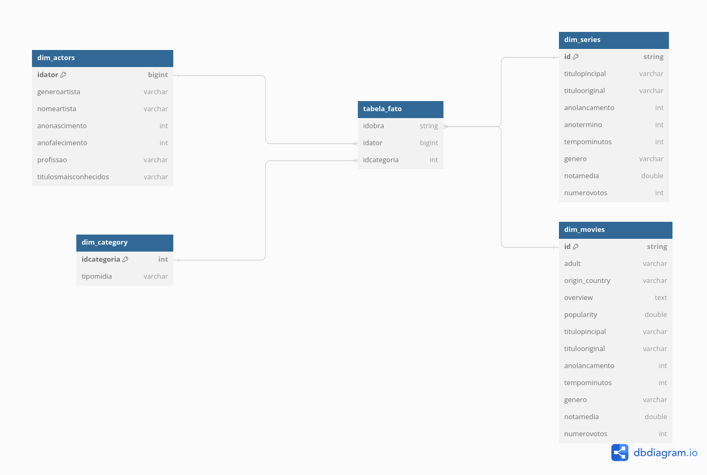
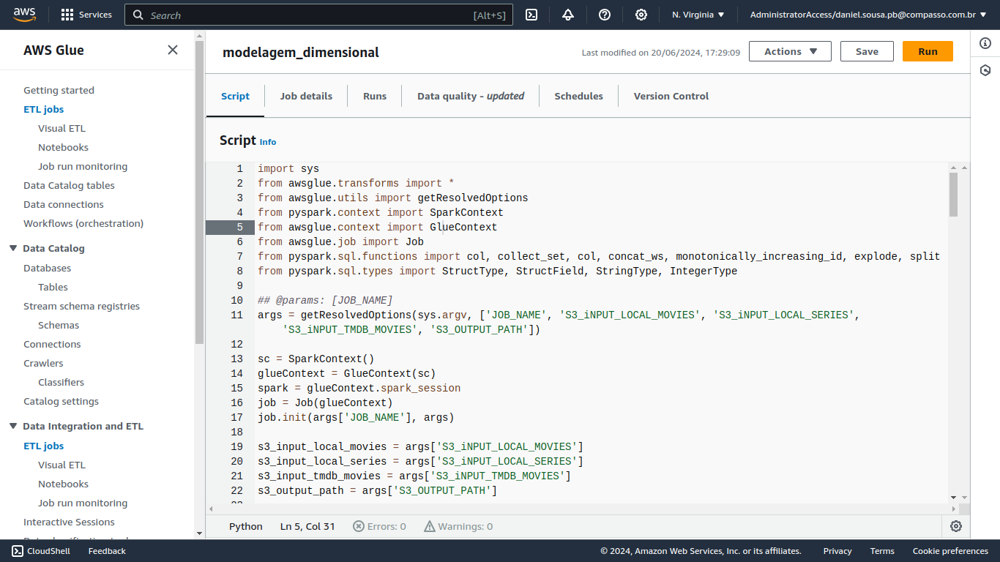
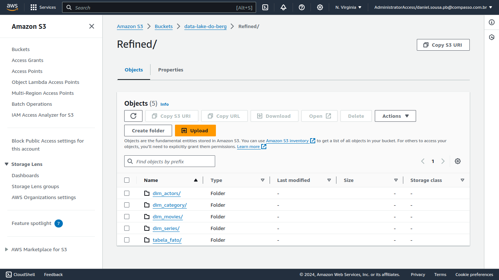
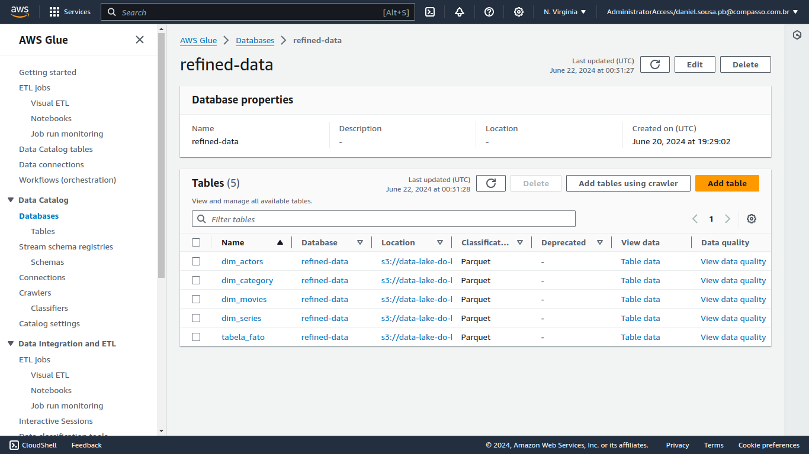

# Desafio 

## Objetivo:

Nesta sprint foi feita a modelagem dos dados, sendo criada a camada refined, onde os dados foram separados em arquivos parquet que representam as tabelas que formam a modelagem dimensional. Para organização dos arquivos e interação com s3 foi criado um job glue com pyspark

## Desenvolvimento

* ### **Código do desafio**

    [Desafio.py](desafio.py)

* ### **Leitura dos dados**

    Primeiramente foi feita a leitura dos arquivos parquet da camada refined, os quais foram transformados  em dataframes spark. Além disso foi criado um novo datraframe através da união do parquet de dados oriundos do json de filmes e do parquet oriundo do csv de filmes, utilizando a chave id para fazer o join.

* ### **Criação da tabela de atores**

    A criação da tabela de atores foi feita a partir da seleção de campos referentes a atores, além do id da obra, dentro do parquet de filmes e dentro do parquet de séries, os quais foram unidos em um único dataframe e em seguida agrupados por seus dados, exceto pelo id da obra, que era concatenado em uma coluna. Após isso foi gerada uma nova coluna com um id incremental para os atores e foi criada a dimensão de atores com os dados exclusivo de atores.

* ### **Criação da tabela de filmes, séries e categoria**

    Com a união dos dados de filme provenientes do TMDB e dos dados locais, para criar a dimensão de filmes foi gerado um novo dataframe através de um select das colunas exclusivas do filme, sendo feita a mesma coisa para criar a dimensão séries. Também foi gerada uma dimensão categoria, a qual possuía um id e tipo de mídia (śerie ou filme)

* ### **Criação da tabela fato**

    A tabela orginou-se a partir da união dos ID's das outras 4 tabelas, porém a coluna que fazia refência ao ID da obra poderia ter ID's de filmes e séries, portanto a coluna categoria era necessária para distinguir a qual tabela o ID pertencia. Para criação dessa tabela foi utilizado o dataframe de atores sobre o qual foi aplicado um groupBy, sendo feita, através da função `explode` do pyspark, a explosão dos valores da coluna onde os ID's das obras estavam concatenados, gerando para cada ID uma linha, de modo que agora tinhamos um coluna com o ID do ator e outra com o ID da obra, em seguida foram selecionadas essas duas colunas para que parte da tabela fato fosse criada.

    Para saber se o ID da obra na tabela fato pertencia a um filme ou a uma série foi feita a seleção das colunas id e mídia nos datraframes de séries e de filmes, e em seguida gerado um dataframe com a união das colunas. Logo após, foi feito um join com a tabela de categorias, gerando um novo dataframe que continha o id da obra (filme ou série) e o id do tipo de midia na categoria. Por fim, foi feito um novo join entre esse novo dataframe gerado e a tabela fato, de modo que a tabela fato passou a ter os ID's das obras, dos atores e das categorias.

* ### **Salvamento dos dados**

    Com as tabelas criadas nos dataframes os dados foram salvos na camada refined do bucket do s3, sendo persitidos no formato parquet e através da função colacesce foi especificado que os mesmos não deveriam ser particionados. Os arquivos parquet gerados foram utilizados como fonte de pesquisa do crawler do glue para gerar tabelas no data catalog.

## Observações

Uma das etapas em que mais tive que pensar foi sobre como faria para gerar a tabela de atores, inicialmente cogitei trazê-los da api do TMDB, porém considerando que teria de fazer pelo menos uma requisição para cada ator, não me pareceu uma solução muito adequada, uma vez que possúia cerca de 59 mil filmes fora as séries e cada um destes possui mais de um ator, de modo que a solução mais viável seria trazer apenas um ator por obra, digamos o mais "importante", contudo ignorar todos os outros atores reduziria e muito minha base de dados. Assim, pensei numa forma de mantê-los, de modo que os agrupei por suas colunas, para evitar erros de comparação de strings únicas, e gerei um id para cada ator, como eu possuía dentro dessa tabela o id das obras que cada ator fez parte concatenados em uma coluna consegui garantir que não estava fazendo uma condição para verificar se ator pertencia a obra e sim ordenando a tabela com informações corretas. 

## Modelo dimensional

## Evidências

* **Job Glue**

* **Camada Refined**

* **Banco de dados do data catalog**

