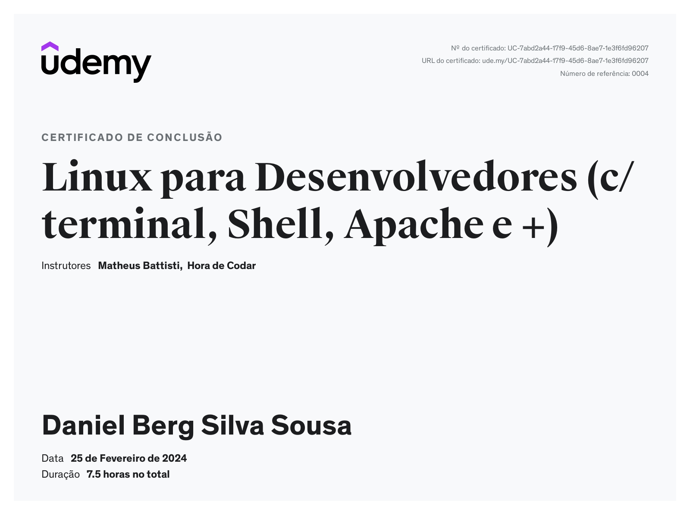
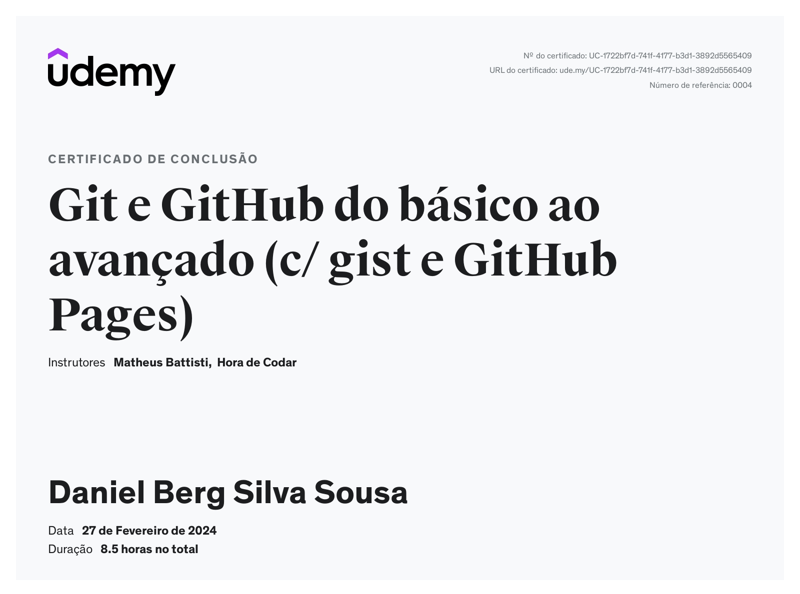

# Documentação

1. [Resumo de Linux](documentacao/Linux/README.md)
2. [Resumo de Git e Github](documentacao/Git%20e%20Github/README.md)

# Desafio

1. [Desafio Sprint 01](desafio/README.md)

# Exercícios & Evidências

1. [Exercício Linux](exercicios/Linux/README.md)
2. [Exercício Git e Github](exercicios/Git%20e%20GIthub/README.md)

# Certificados

- Linux para Desenvolvedores (c/ terminal, Shell, Apache e +)

- Git e GitHub do básico ao avançado (c/ gist e GitHub Pages)

- Data & Analytics - PB - AWS - Novo - 1/10

