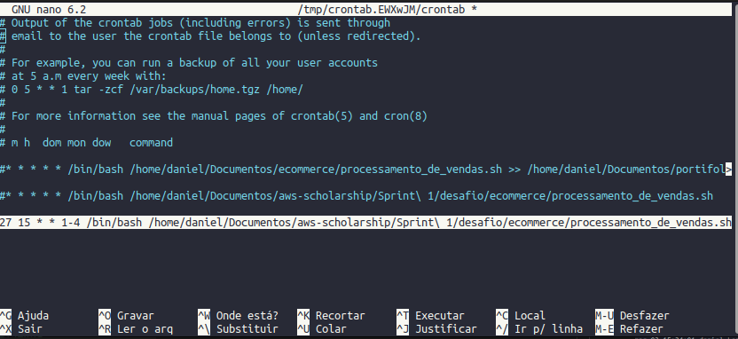
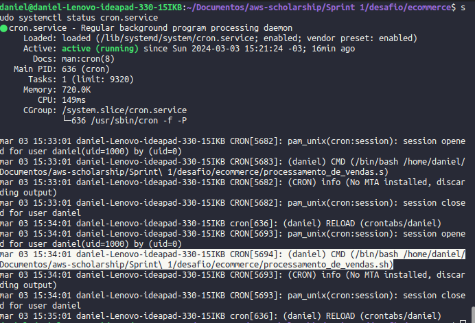
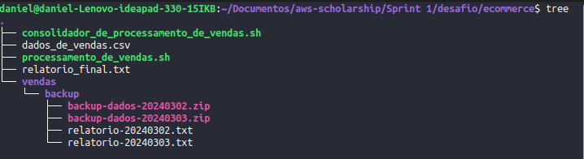

# Evidências do desafio

## 1. Linha de excução sendo adicionada no crontab

## 2. Execução de processamento_de_venda.sh pelo crontab.

## 3. Estrutura de pastas criadas

## 4. Relatório final gerado

[Ver relatório final](../ecommerce/relatorio_final.txt)