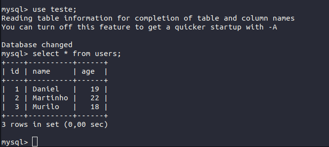
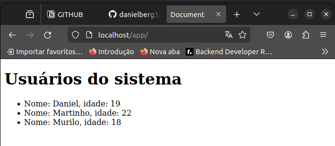

## Servidor apache

Neste exercício foi escrito um código PHP para seleção de dados em um banco de dados mysql e exibição dos mesmos em uma página HTML.

### Dados no banco de dados

### Página web

### Observação

Os scripts php estão na pasta [app](app/).