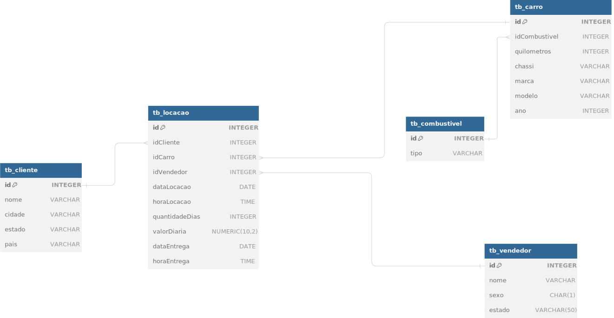
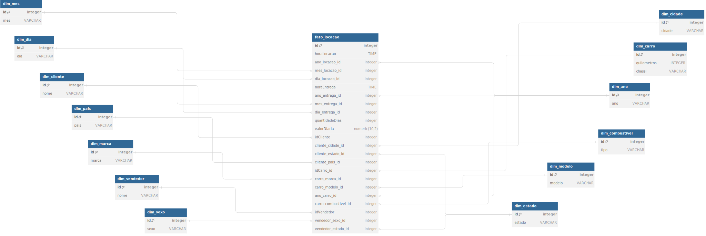

# Desafio

Para resolução do desafio foi feita inicialmente a normalização da tabela, que consistiu na retirada de dados id's que não eram de locação e criação de tabelas para cada id, onde os dados que estavam associados a um id foram para sua respectiva tabela.

Em seguida foi feito o vínculo entre as tabelas através das foreign key's, onde todas as tabelas criadas se ligavam a tabela locação, exceto pela tabela tb_combustivel, que estava relacionada com a tabela tb_carro.

Essa abordagem deu origem a modelagem ER

- [Código para normalização da tabela](modelo-ER.sqlite)

- Modelo ER

Como etapa Final do desafio foi feita a modelagem dimensional, que consistiu em observar dados que não possuíssem uma granularidade tão alta, sendo criadas dimensões para eles. Isso resultou na criação de 14 tabelas, 13 para as dimensões criadas e 1 para tabela fato. Essa abordagem fez com que nosso sistema pudesse ser o mais performático possível, removendo duplicidades das tabelas dimensões e inserindo apenas dados dos tipos numéricos e data na tabela fato.

- [Código para Modelo dimensional](modelo-dimensional.sqlite)

- Modelo Dimensional

