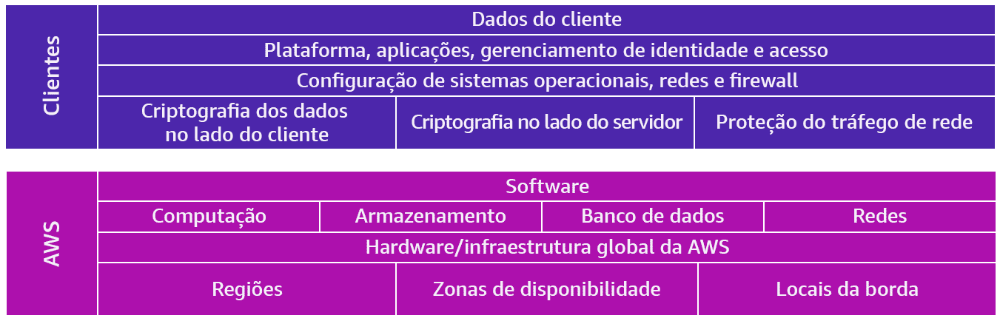

## Infraestrutura global da AWS

A infraestrutura da AWS é dividida em regiões, que se dividem em zonas de disponibilidade, que se dividem em datacenters. Para escolher em qual região deseja hospedar seu serviço é importante considerar: a Conformidade, Latência, preços e Disponibilidade de serviço.

Quando utilizamos serviços da AWS é importante sabermos quais as responsabilidades da AWS e quais as dos clientes. A imagem abaixo ilustra essa divisão.

* IAM

Com o objetivo de garantir maior segurança, a AWS criou um produto chamado IAM, o qual ajuda no gerenciamento de sua conta, controlando quem tem acesso à conta e quem pode utilizar os serviços.

## Serviços AWS

### EC2

O Elastic Compute Cloud disponibiliza capacidade computacional segura e redimensionável na nuvem. Com ele é possível criar instâncias, que são servidores virtuais para execução dos seus serviços.

### ECS EKS

São ferramentas de orquestração de containers disponíveis como serviços da AWS.

### Aws Lambda

Ao utilizar a nuvem podemos optar por um serviço sem servidor, nesse caso podemos utilizar funções lambda, com as quais podemos executar ações com um custo dado por tempo de execução, o qual pode levar milisegundos.

## Redes

Para garantir a comunicação entre as partes de nosso projeto é necessário criar uma virtual private cloud (VPC), que nada mais é que uma rede isolada criada na Nuvem AWS. Sua criação depende de três fatores: Nome da VPC, Região em que a VPC ficará ativa e Intervalo de IP para a VPC na notação CIDR.

## Armazenamento

Na AWS o armazendo é feito em 3 formatos, sendo estes: armazenamento de blocos, armazenamento de arquivos e armazenamento de objetos. Enquanto o armazenamento de arquivos armazena como uma unidade o armazeno de bloco divide o conteúdo em partes de igual tamanho

Podemos armazenar conteúdo dentro das instâncias do EC2, porém isso não é muito recomendado, pois se removermos as instâncias os dados não irão persistir. Para persistir os dados devemos então utilizar o EBS, que não está dentro da instância.

Uma outra possibilidade é utilizar o Amazon S3, pois além de ser acessível em toda web, já que não está vinculado a computação, a maioria dos volumes EBS só pode ser conectado a uma instância por vez. É importante saber que para adicionar objetos ao S3 antes é necessário criar um bucket.

## Bancos de Dados

A AWS possibilita a criação de diversas instâncias de bancos de dados, e possui serviços variados para atender as necessidades do cliente, ente eles estão:

* Amazon RDS: Banco de dados relacional.
* Amazon DynamoDB: Banco de dados não relacional.
* Amazon DocumentDB: Compatível com o MongoDB.
* Amazon Neptune: Banco de dados de grafo.
* Amazon QLDB: Banco de dados Ledger.