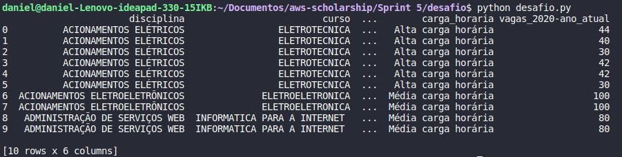

# Desafio

Para resolução do desafio foram utilados script python, query's sql e o boto3. O fluxo consistiu em a partir do python com o boto3 fazer a criação de um bucket dentro do serviço s3 da aws, em seguida foi feito o upload do arquivo [discipĺinas-ifal-2022.csv](disciplinas-ifal-2022.csv), logo após foram feitas duas consultas no csv dentro do bucket.

## Links rápidos:

* [Script python](desafio.py)
* [Primeira consulta (arquivo SQL)](primeiro-comando.sql)
* [Segunda consulta (arquivo SQL)](segundo-comando.sql)

## Fluxo

### Configuração do cliente

A partir da função **client** do boto3 foi gerado um um novo cliente para o serviço s3, passando como parâmetro o serviço utilizado (s3), o id da chave de acesso, a chave de acesso secreta, o token para sessão e a região. Os valores passados foram preenchidos com dados oriundos de um arquivo .env.

### Criação do bucket (create_bucket(bucket_name))

Com o cliente configurado foi criado bucket com a função **create_bucket**, que recebeu o nome do bucket por parâmetro, em caso de erro for falha nas credenciais do cliente era gerada uma exceção.

### Upload do CSV (upload_csv(file, bucket_name))

Após o bucket ter sido criado foi feita a leitura do arquivo com a função **open** do python e em seguida este foi enviado com a função **put_object** do boto3, que recebia como parâmetros o nome do bucket, o nome do arquivo e os dados a serem enviados.

### Bucket e arquivo CSV no console da aws

### Consulta no arquivo CSV (query_csv(bucket_name, account_id, query_consulta))

Para consulta dentro do csv foi utilizado o método **select_object_content**  do boto3, que recebia por parâmetro o nome do bucket, o nome do arquivo csv a ser pesquisado, a query sql, o id da conta e mais algumas informações sobre o arquivo de pesquisa e os dados a serem retornados. Como reposta foi obtido um json com diversos campos e foi validado se o retorno do mesmo era um status 200, caso verdadeiro, através de um laço for os dados contidos no campo **Payload** eram gravados na variável records utilizando o padrão de decode utf-8.

### Query's SQL

As query's criadas para atender os itens informados no desafio são [primeiro-comando.sql](primeiro-comando.sql) e [segundo-comando.sql](segundo-comando.sql). A divisão da consulta em duas partes ocorreu porque o s3 select possui funcionalidades reduzidas, não possuindo a função **group by**, ou seja, a combinação do itens pedidos com as funções de agregação quebrariam a consulta.

* ### Primeira Consulta - campos:

    **disciplina:** Disciplina do curso.

    **curso:** Nome do curso.

    **campus:** Nome do campus.

    **modalidade:** Tipo de modalidade utilizando a função de string UPPER().

    **carga horaria:** Condicional que classifica a carga horária (baixa, média, alta) a patir do do campo ch da disciplina, o qual sofreu uma conversão  de tipo para inteiro.

    **vagas_2020-ano_atual:** resultado obtido através da extração do ano da data atual, do qual é subtraído o ano do período em que o curso iniciou no csv, logo em seguida o resultado é multiplicado pela quantidade de vagas da disciplina.

    Os campos foram selecionados mediante uma cláusula **where** que filtra as linhas que tenham como campus maceio ou arapiraca e que a modalidade seja integrado. Além disso, foi utilizado um limit 10 para trazer apenas os 10 primeiros registros encontrados.

    Com os dados obtidos foi criado um data frame pandas para melhor visualização.

    * Resultado:

    

* ### Segunda Consulta - campos:

    **Turmas:** Quantidade de vezes em que um disciplina aparece no csv utilando a função COUNT() do SQL.

    **Vagas:** Total de vagas obtidas ao somar todas as vagas de todas as turmas de uma disciplina específica.

    Foi utilizada a cláusula **WHERE** para trazer apenas a disciplina do de matemática da modalidade integrado, pois a falta do group by não deixa que sejam retornados dados relevantes sem uma condição muito específica.

    Os dados foram exibidos no terminal.

    * Resultado:

    