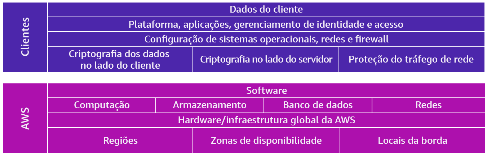

# Curso-padrão de preparação para o exame: AWS Certified Cloud Practitioner

## Conceitos de nuvem

Computação em nuvem:

- Autoatendimento sob demanda
- Acesso à rede
- Agrupamento de recursos
- Elasticidade
- Uso de recursos monitorado e cobrado

AWS Well-Achitected Framework:

- Excelência operacional
- Segurança
- Confiabilidade
- Eficiência de desempenho
- Otimização de custos
- Sustentabilidade

Estratégias de migração para a nuvem:

- Retirar
- Reter
- Redefinir hospedagem
- Realocar
- Recomprar
- Redefinir plataforma
- Refatorar ou refazer arquitetura

Custos totais de propriedade (TCO):

- Despesas operacionais
- Despesas de capital
- Custos de mão de obra
- Custos de licenciamento de software

## Segurança e conformidade

Para garantir a segurança na conta da AWS é recomendado não utilizar o usuário root para tarefas diárias, para isso é possível criar usuários com IAM  e conceder apenas as permissões necessárias para o desenvolvimento.

## Tecnologia e serviços em nuvem

Ao utilizar a nuvem AWS existem níveis de acesso à internet, o que permite que serviços estejam na zona pública ou privada da AWS, caso estejam na zona privada será necessário configurar permissões de acesso para comunicação com a internet pública.

Alguns serviços da AWS:

- EC2: Serviço de computação que provê uma máquina utilizando virtualização.
- ECS e EKS: Serviços de containers.
- EBL: Balanceador de carga utilizado para distribuição de tráfego entre as várias instâncias.
- Funções LAMBDA: Funções de execução orientada a eventos com custo dependente do tempo de execução.

Serviços de banco de dados da AWS:

- Amazon RDS
- Amazon Aurora
- Amazon DynamoDB
- Amazon Redshift

Quando utilizamos os serviços da AWS é importante ter em mente que será necessário configurar a rede dos serviços, tal configuração é realizada através do Amazon VPC, no qual teremos a faixa de IP’s, o gateway, entre outros.

Opções de armazenamento na AWS:

- Objeto
- Arquivo
- Bloco

Serviços Inteligência artificial:

• Amazon Translate 

• Amazon Polly

• Amazon Lex

• Amazon Comprehend

• Amazon Forecast

• Amazon CodeGuru

• Amazon Rekognition

Serviços Machine learning:

• AWS SageMaker

• Amazon CodeWhisperer

Serviços Frameworks e infraestrutura de ML:

• TensorFlow

• PyTorch

• Apache MXNet

## Cobrança, preços e suporte

Ao utilizar serviços da nuvem, saiba que você só irá pagar pelo que utiliza, pois devido a alta escalabilidade dos serviços é possível realocar recursos conforme é necessário, além de utilizar os serviços mais adequados para sua implantação. Durante o processo planejamento da migração para nuvem é possível utilizar a calculadora de custos da AWS para se ter um referencial.

Ferramentas de gerenciamento de custos:

- AWS Cost Explorer
- AWS relatório de uso  e custo