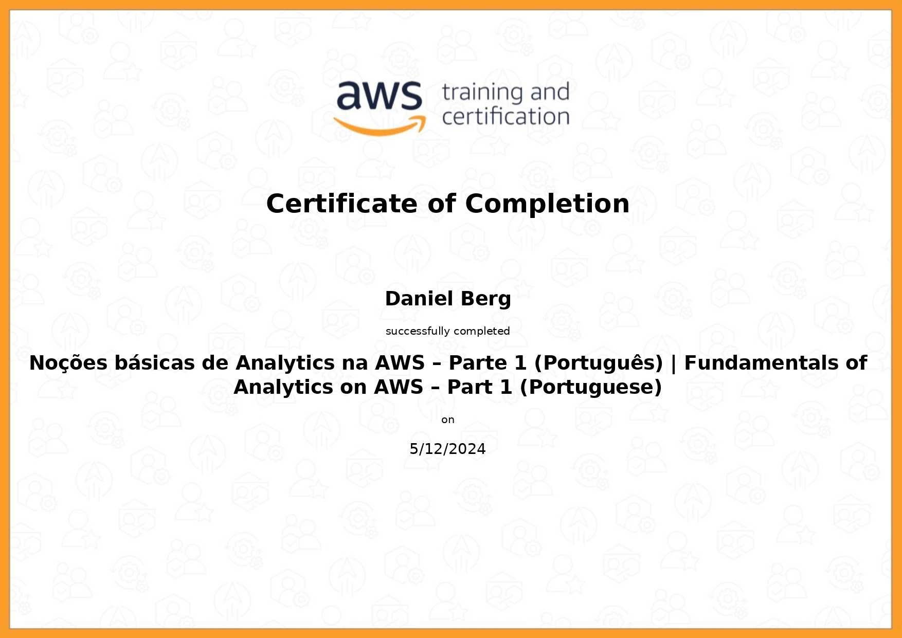

# Desafio

1. [Desafio Sprint 06](/Desafio/etapa-1/README.md)

# Exercício

1. [Exercício Sprint 06](exercicios/README.md)

# Certificados

- Noções básicas de Analytics na AWS

- Introduction to Amazon Athena

- Getting Started with Amazon Redshift

- Best Practices for Data Warehousing with Amazon Redshift

