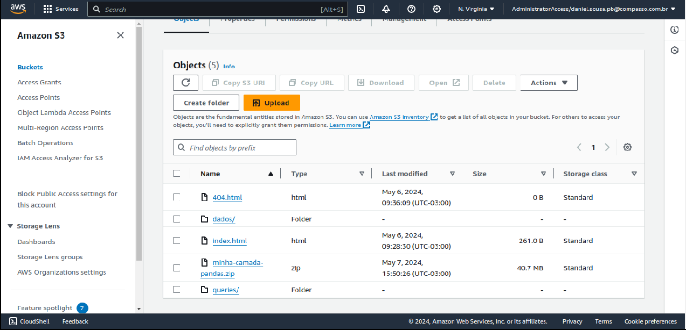
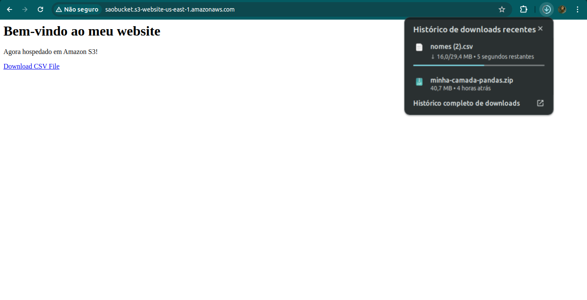
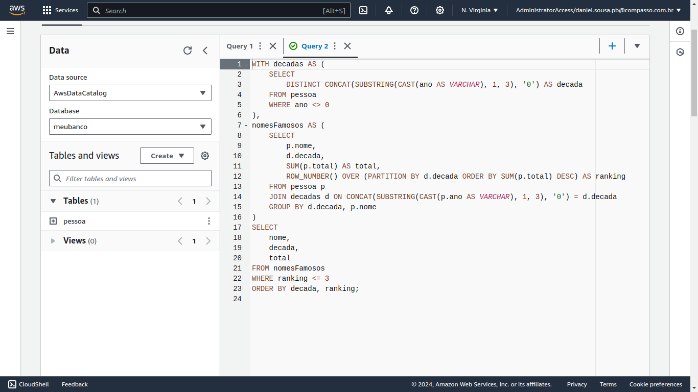
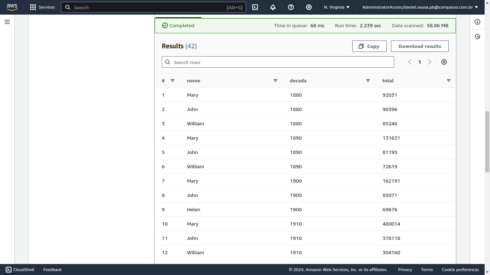
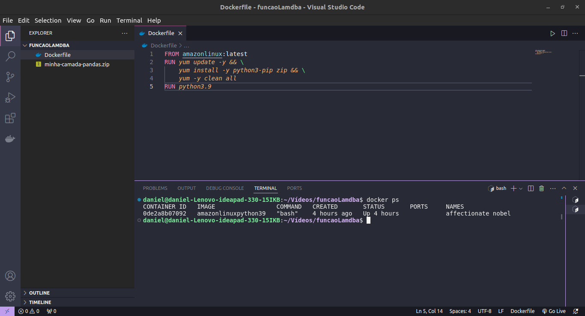
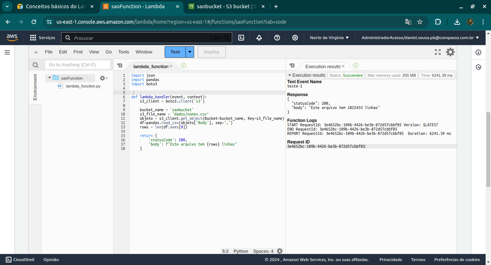

# Exercícios

## Bucket S3

* Criação do bucket dentro do Amazon S3 contendo os arquivos para realização das próximas etapas:

* Site estático renderizado a partir do arquivo index.html dentro do bucket:

## Amazon Athena

* Query dentro do Amazon Athena para consulta dos 3 nomes mais utilzados em cada decáda conforme dados do csv que está armazenado no bucket:

* Resultado da query:

## Função Lambda

* Dockerfile com instruções para gerar arquivo com layer personalida para função Lambda:

* Resultado da execução da função lambda de comunicação com o bucket:

