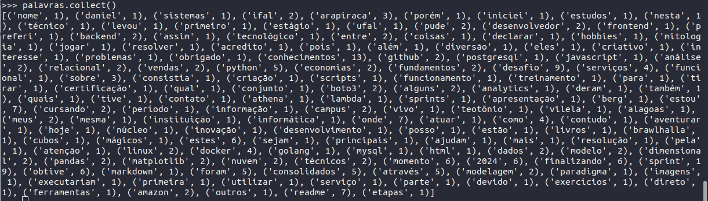

# Exercício

O exercício consiste em contar quantas vezes cada palavra aparece no arquivo readme.md


Criar pasta para armazenar o arquivo:

```shell
mkdir dados
```
Navegar até a pasta:

```shell
cd dados
```

Baixar arquivo README.md do drive pessoal:

```
wget --no-check-certificate 'https://drive.google.com/uc?export=download&id=1_u3x1JBAl6eZKs3YcXFBrgZn_wg91_dU' -O README.md
```

Importar bibliotecas a serem utilizadas:

```shel
from pyspark.sql import SparkSession
from operator import add
import re
```

Ler arquivo e transformar em um RDD:

```shell
arquivo = sc.textFile('/home/jovyan/dados/README.md')
```

Contar quantidade de palavras:

```shell
palavras = arquivo.flatMap(lambda line: re.split('\W+', line.lower().strip()))
```


Filtrar apenas palavras com mais de 3 letras:

```shell
palavras = palavras.filter(lambda x: len(x) > 3)
```

Inicializar um novo RDD com as palavras definidas como chave e o valor inicial como 1:

```shell
palavras = palavras.map(lambda w: (w,1))
```

União das chaves iguais e utilização da função add para somar o conteúdo de seus valores:

```shell
palavras = palavras.reduceByKey(add)
```

Apresentar conteúdo do RDD:

```shell
palavras.collect()
```

Resultado:

